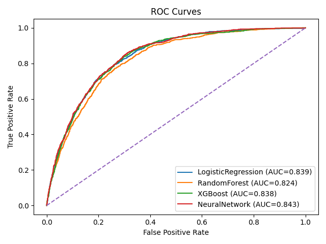
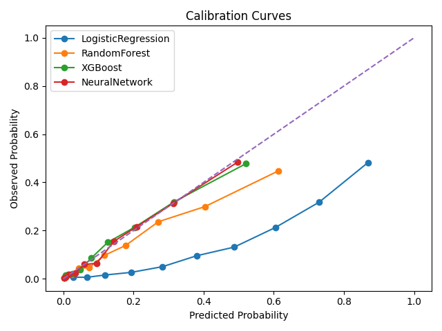
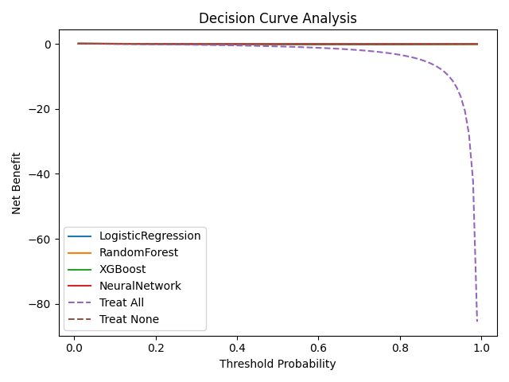
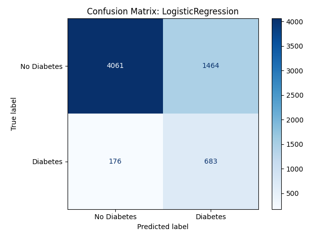
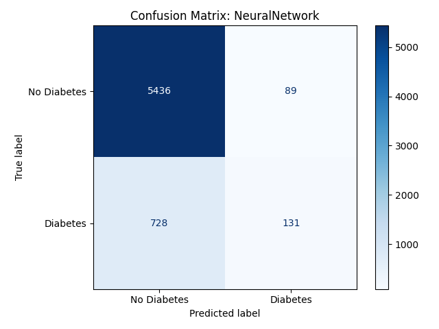
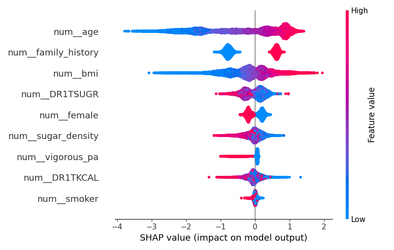

# Diabetes Risk Prediction using NHANES Data

## Overview
This project builds and evaluates machine learning models to predict the risk of Type-2 diabetes using demographic, behavioral, and dietary variables from the **NHANES (National Health and Nutrition Examination Survey)** dataset. The objective is to compare classical and modern machine learning approaches while evaluating discrimination, calibration, clinical utility, and interpretability.

---

## Dataset
- **Source:** NHANES 2007–2020  
- **Unit of analysis:** Individual survey participants  
- **Outcome variable:** Self-reported diabetes status (`DIQ010`)  

### Predictor Categories
- **Demographic:** Age, sex  
- **Anthropometric:** BMI  
- **Behavioral:** Smoking status, physical activity  
- **Family history:** Diabetes history  
- **Dietary:** Total calories, total sugar  
- **Engineered feature:** **Sugar density** (grams of sugar per 1000 kcal)

Non-informative identifiers (e.g., `SEQN`, survey cycle) and diagnosis-related variables were removed to avoid data leakage.

---

## Feature Engineering
- Binary recoding of categorical variables
- Engineering of **sugar density** to normalize sugar intake by caloric intake
- Median imputation for missing numeric values
- Standardization of numeric features
- One-hot encoding of categorical features

---

## Models Evaluated
Models were trained using an **80/20 stratified train-test split**.

- **Logistic Regression** (baseline linear model)
- **Random Forest**
- **XGBoost**
- **Feed-Forward Neural Network (Multilayer Perceptron)**

The neural network was trained separately from the scikit-learn pipeline using the same preprocessed feature space.

---

## Evaluation Metrics
Performance was evaluated using:

- **Discrimination:** ROC curves and ROC-AUC  
- **Classification performance:** Confusion matrices, accuracy, precision, recall, F1-score  
- **Calibration:** Calibration curves and Brier score  
- **Clinical utility:** Decision Curve Analysis  
- **Interpretability:** SHAP feature importance (tree-based models)

---

## Results

### ROC Curves
All models achieved good discriminative performance (ROC-AUC ≈ **0.82–0.85**).



---

### Calibration Curves
Tree-based models and the neural network showed better probability calibration than logistic regression.



---

### Decision Curve Analysis
All models provided positive net benefit over *treat-all* and *treat-none* strategies across clinically relevant thresholds.



---

### Confusion Matrices

**Logistic Regression**


**Random Forest**


**XGBoost**


**Neural Network**


---

### SHAP Feature Importance (XGBoost)
SHAP analysis highlights the most influential predictors of diabetes risk:
- Age
- BMI
- Family history
- Dietary sugar intake and sugar density
- Physical activity (protective effect)



---

## Results Summary Table
All numeric results are saved in: outputs/model_results.csv


Key observations:
- Logistic Regression achieves the highest recall, making it suitable for screening.
- Neural Network and XGBoost favor precision and calibrated risk estimates.
- Performance differences are modest, suggesting largely linear risk structure.

---

## Project Structure
```text
cs559_diabetes_prediction/
├── data/
│   └── nhanes_diabetes_2007_2020_clean.csv
├── src/
│   ├── feature_engineering.py
│   ├── models.py
│   ├── evaluation.py
│   └── train.py
├── outputs/
│   ├── roc_curves.png
│   ├── calibration_curves.png
│   ├── decision_curve.png
│   ├── confusion_matrix_*.png
│   ├── shap_summary_xgboost.png
│   └── model_results.csv
├── requirements.txt
└── README.md
```

## How to Run
```bash
python -m venv venv
source venv/bin/activate
pip install -r requirements.txt
python src/train.py
```
## Notes
- All preprocessing steps were fit on training data only to prevent leakage.
- SHAP explanations were applied only to tree-based models, where exact explanations are available.
- Neural network SHAP was omitted due to instability of kernel-based methods on tabular data.

## Conclusion

Machine learning models can effectively predict diabetes risk using survey-based demographic, behavioral, and dietary data. While ensemble models and neural networks provide modest improvements in discrimination and calibration, simpler linear models remain competitive and interpretable, highlighting important trade-offs between sensitivity, precision, and clinical applicability.


---
